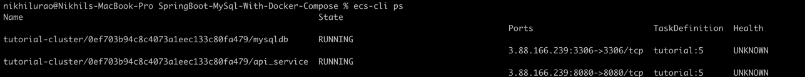

# SpringBoot-MySql-With-Docker-Compose
The Way of Dockerize a Spring Boot and MySQL Application With Docker Compose.

#  deploy a Docker compose stack on AWS ECS
## Prerequisites 
aws account
jq
aws-cli
brew (for macOS)

1. Install ecs-cli
   The complete installation procedure for macOS, Linux and Windows is available here: https://docs.aws.amazon.com/AmazonECS/latest/developerguide/Welcome.html
2. Configure ecs-cli
   ecs-cli allows you to deploy a Docker stack very easily on AWS ECS using the same syntax as the docker-compose file format version 1, 2 and 3 
   The selling point of ecs-cli is to reuse your docker-compose.yml files to deploy your containers to AWS 
   ecs-cli translates a docker-compose-yml to ECS Task Desfinitions and Services
   Prerequisite 
   AWS CLI v2 must be installed. If it's not the case you can follow these instructions here: https://docs.aws.amazon.com/cli/latest/userguide/getting-started-install.html.
   You need to have an AWS_ACCESS_KEY_ID / AWS_SECRET_ACCESS_KEY with administrative privileges.
   To create your AWS_ACCESS_KEY_ID you can read here: https://docs.aws.amazon.com/IAM/latest/UserGuide/id_credentials_access-keys.html 
   Your environment variables must be configured with a correct pair of AWS_ACCESS_KEY_ID / AWS_SECRET_ACCESS_KEY
   export AWS_ACCESS_KEY_ID="Your Access Key"
   export AWS_SECRET_ACCESS_KEY="Your Secret Access Key"
   export AWS_DEFAULT_REGION=us-east-1
   Final step run aws-scripts/configure.sh to configure ecs-cli

3. Create the cluster Stack and a Docker Compose Stack
We will create an ECS-Cluster based on ec2 instance.
ECS allows 2 launch types EC2 and FARGATE
EC2 (Deploy and manage your own cluster of EC2 instances for running the containers)
AWS Fargate (Run containers directly, without any EC2 instances)
If we want to connect to the ec2 instances with ssh we need to have a key pair
 Create of a key pair called tutorial-cluster by running aws-scripts/create-key-pair.sh

run: docker-compose up from the project directory where the docker-compose.yml file is present to create compose stack to test in local of spring boot app with mysql db containers

Finally run aws-scripts/create-cluster.sh to create a ECS cluster
   
4. Deploy the docker compose stack on AWS ECS
run aws-scripts/deploy.sh
To verify that the service is running we can use this command:
ecs-cli ps
you should be able to see the below,

test your api: http://3.88.166.239/all 

   

